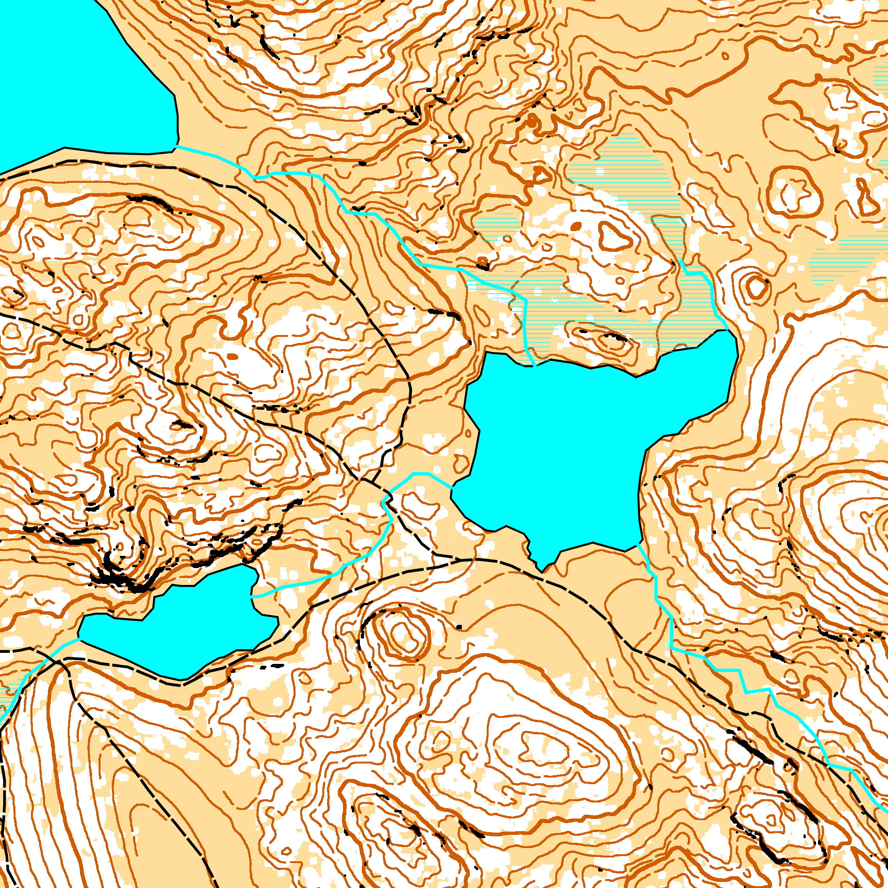

# Cassini



Cassini is a software that generates highly accurate topographic maps from [LiDAR](https://en.wikipedia.org/wiki/Lidar) data and shapefiles vector data. The maps produced by Cassini follow the [International Specification for Orienteering Maps (ISOM)](https://orienteering.sport/wp-admin/admin-ajax.php?action=shareonedrive-download&id=663580750D0C0BCE!50104&dl=1&account_id=663580750d0c0bce&drive_id=663580750d0c0bce&listtoken=b03290e8f4203fe6219ea68270f084bc), witch is the most detailed specification for topographic maps.

This project is heavily inspired by [Karttapullautin](https://github.com/rphlo/karttapullautin/tree/master) and [Terje Mathisen's pipeline](https://tmsw.no/mapping/basemap_generation.html). Unlike them, it uses the [PDAL](https://pdal.io) and the [GDAL](https://gdal.org) libraries to preprocess the LiDAR data.

Cassini is very early stage and still an experimental project. Use it at your own risks, expect API changes and bugs! Please [fill an issue](https://github.com/NicoRio42/cassini/issues/new) if you find any bug.

Cassini is (humbly) named after the [Cassini map](https://en.wikipedia.org/wiki/Cassini_map), which is the first topographic and geometric map made of the Kingdom of France as a whole, by the Cassini family in the 1700's.

## Getting started

Set up a Rust environment on your machine if you do not have one: [rustup](https://rustup.rs/)

Install `miniconda`: [miniconda](https://docs.anaconda.com/miniconda/#quick-command-line-install)

Create a virtual environment with PDAL and GDAL:

```sh
conda create --yes --name cassini --channel conda-forge pdal gdal
```

Activate the environment when you open a new terminal:

```sh
conda activate cassini
```

Running the project:

```sh
cargo run
```

Building the project:

```sh
cargo build
```

On Ubuntu, install these libs:

```sh
sudo apt install libfontconfig1-dev libfreetype6-dev
```
