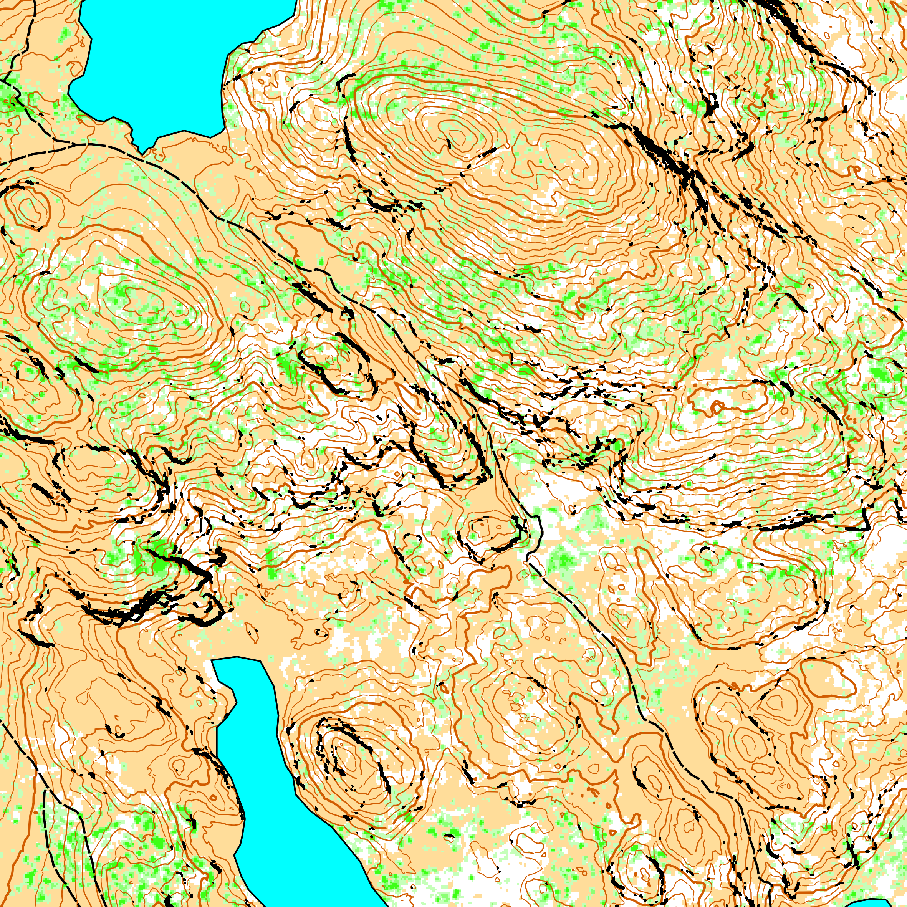

# Orienteering map generator



A software to generate orienteering maps from [LiDAR](https://en.wikipedia.org/wiki/Lidar) data and shapefiles vector data.

This project is inspired by [karttapullautin](https://github.com/rphlo/karttapullautin/tree/master) and [this article from Terje Mathisen](https://tmsw.no/mapping/basemap_generation.html). Unlike them, it uses the [PDAL](https://pdal.io) and [GDAL](https://gdal.org) libraries to preprocess the LiDAR data.

This project is still experimental and very early stage. It is meant to be used for the [mapant.fr](https://mapant.fr) project, so it is for now very "France centric".

Disclaimer: I am learning Rust along the way, so code quality is not guaranteed 😉

## Getting started

Set up a Rust environment on your machine if you do not have one: [rustup](https://rustup.rs/)

Install `miniconda`: [miniconda](https://docs.anaconda.com/miniconda/#quick-command-line-install)

Create a virtual environment with PDAL and GDAL:

```sh
# Replace myenv with a name for your environment
conda create --yes --name myenv --channel conda-forge pdal gdal
```

Activate the environment when you open a new terminal:

```sh
# Replace myenv with a name for your environment
conda activate myenv
```

Running the project:

```sh
cargo run
```

Building the project:

```sh
cargo run
```
