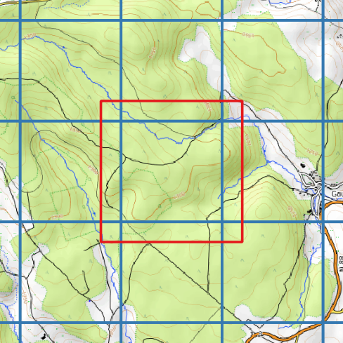

## What is Cassini

Cassini is a software that generates highly accurate [topographic maps](https://en.wikipedia.org/wiki/Topographic_map) from [LiDAR](https://en.wikipedia.org/wiki/Lidar) data and [Shapefile](https://en.wikipedia.org/wiki/Shapefile) vector data. The maps produced by Cassini follow the [International Specification for Orienteering Maps (ISOM)](https://orienteering.sport/wp-admin/admin-ajax.php?action=shareonedrive-download&id=663580750D0C0BCE!50104&dl=1&account_id=663580750d0c0bce&drive_id=663580750d0c0bce&listtoken=b03290e8f4203fe6219ea68270f084bc), witch is the most detailed specification for [topographic maps](https://en.wikipedia.org/wiki/Topographic_map).

This project is heavily inspired by [Karttapullautin](https://github.com/rphlo/karttapullautin/tree/master) and [Terje Mathisen's pipeline](https://tmsw.no/mapping/basemap_generation.html). Unlike them, it uses [PDAL](https://pdal.io) (The Point Data Abstraction Library) and [GDAL](https://gdal.org) (The Geospatial Data Abstraction Library) to preprocess the [LiDAR](https://en.wikipedia.org/wiki/Lidar) data.

:::caution
Cassini is very early stage and still an experimental project. Use it at your own risks, expect API changes and bugs! Please [fill an issue on Github](https://github.com/NicoRio42/cassini/issues/new) if you find any bug.
:::

:::note[Did you know?]
Cassini is (humbly) named after the [Cassini map](https://en.wikipedia.org/wiki/Cassini_map), which is the first topographic and geometric map made of the Kingdom of France as a whole, by the Cassini family in the 1700's.
:::

## Why does Cassini exist

Cassini is developped to be the main rendering engine for the [Mapant.fr](https://mapant.fr) project. The project goal is to generate the most precise topographic map of France out of freely available [LiDAR](https://en.wikipedia.org/wiki/Lidar) data and [Shapefile](https://en.wikipedia.org/wiki/Shapefile) data. It is inspired by its predecessors:

- [Mapant.fi](https://www.mapant.fi/) for Finland
- [Mapant.no](https://mapant.no/) for Norway
- [Gokartor](https://kartor.gokartor.se/) for Sweden
- [Mapant.es](https://mapant.es/) for Spain
- [Mapant.ch](https://www.mapant.ch/) for Switzerland
- [Mapant.orienteering.lu](https://mapant.orienteering.lu/) for Luxembourg

All of these projects somehow used [Jarkko Ryyppö](https://x.com/RouteGadget)'s [awsome Karttapullautin original Perl program](https://routegadget.net/karttapullautin/) to generate the map (at the exeption of [Mapant.no](https://mapant.no/) that used the [OCAD](https://www.ocad.com/) mapping software). Now that [Karttapullautin](https://github.com/rphlo/karttapullautin/tree/master) has been rewritten in [Rust](<https://en.wikipedia.org/wiki/Rust_(programming_language)>) by [Raphaël Stefanini](https://www.linkedin.com/in/rphlo/), the performances are better than ever.

However, there is some reasons that pushed me to develop my own rendering engine for [Mapant.fr](https://mapant.fr).

### The point cloud reading bottleneck

A [LiDAR](https://en.wikipedia.org/wiki/Lidar) file is basically just a list of millions of 3 dimensions points (with some metadata). To process it, a program should at some point loop over all these points, witch is very time consuming. [Karttapullautin](https://github.com/rphlo/karttapullautin/tree/master) uses the popular [`las` Rust library](https://crates.io/crates/las) to do so. For some reason (that I ignore), this library performs worst than the [C++](https://en.wikipedia.org/wiki/C%2B%2B) equivalent programs ([PDAL](https://pdal.io), The Point Data Abstraction Library or [LasTools](https://lastools.github.io/)).

### The edges artifacts problem

The surface area of France is 551,695 square kilometers. This means that there is 551,695 one kilometer large tiles to process to generate the [Mapant.fr](https://mapant.fr) map. This is way too much work for one computer, so it should be distributed on several machines.

To easily distribute the computing, a worker node should be able to render one tile after another independently. But this is easier said than done because of the edges artifacts problem.

 generated map with artifacts on the edges](../../assets/artifacts.png)

On the right border of the [LiDAR](https://en.wikipedia.org/wiki/Lidar) generated map above, you can see artifacts on [contours](https://en.wikipedia.org/wiki/Contour_line) and vegetation. There are artificially more [formlines](https://omapwiki.orienteering.sport/symbols/103-form-line/), and there is a thin vertical white band. This is because the [contours](https://en.wikipedia.org/wiki/Contour_line) and the vegetation generation algorithms need to know about the close neighborhood of a cell during computing, and this neighborhood is incomplete at the edges of a [LiDAR](https://en.wikipedia.org/wiki/Lidar) file.

To remedy this problem, a classic approach is to add a buffer to every tiles:

- You download the 8 adjacent [LiDAR](https://en.wikipedia.org/wiki/Lidar) tiles.
- You generate a new [LiDAR](https://en.wikipedia.org/wiki/Lidar) tile with a 200 meters buffer all around it.
- You generate the map for this tile (for example with [Karttapullautin](https://github.com/rphlo/karttapullautin/tree/master)).
- You crop the resulting image to the original tile extent

This way the artifacts are cropped away from the resulting image. This technique has the advantage of being simple. However, it is very inefficient. The problem is that:

- All the points of the 9 tiles (the targeted tile and the 8 adgacent ones) have to be read to create the buffered tile.
- Then, all the points from the buffered tile have to be read again during the map generation.

As mentioned in the previous paragraph, reading [LiDAR](https://en.wikipedia.org/wiki/Lidar) points is very time consuming. It takes up a large part of the calculation time. With this approach, 10 times more points have to be read, compared to if you could just directly process the original tile without buffer.

### The Cassini approach

Cassini is designed to adress these two problems. To improve the point cloud reading speed, it simply uses the [PDAL](https://pdal.io) library to read and preprocess the [LiDAR](https://en.wikipedia.org/wiki/Lidar) data.

To solve the edges artifacts problem, it uses a much more efficient approach than the one described above. First, all [LiDAR](https://en.wikipedia.org/wiki/Lidar) tiles are processed once with [PDAL](https://pdal.io). During this step, the program produces temporary files that are not subject to the edges artifacts problem:

- A Digital Elevation Model, representing the terrain elevation
- A set of vegetation density [rasters](https://desktop.arcgis.com/en/arcmap/latest/manage-data/raster-and-images/what-is-raster-data.htm) (one for low vegetation, and one for high vegetation)

These [rasters](https://desktop.arcgis.com/en/arcmap/latest/manage-data/raster-and-images/what-is-raster-data.htm) are not subject to the edges artifacts problem because:

- The tile's extent area is clipped to one meter by one meter cells.
- A value is attributed to each of these cells depending only on the points that it contains.
- Thus the value does not depend on the neighborhood of the cell.

Then, a buffer is added to these raster, using the adgacent tiles [rasters](https://desktop.arcgis.com/en/arcmap/latest/manage-data/raster-and-images/what-is-raster-data.htm) just like in the approach described in the paragraph above. It is orders of magnitudes faster to add a buffer to a [raster](https://desktop.arcgis.com/en/arcmap/latest/manage-data/raster-and-images/what-is-raster-data.htm) than to add a buffer to a [LiDAR](https://en.wikipedia.org/wiki/Lidar) tile. Finally, the map is generated from these [rasters](https://desktop.arcgis.com/en/arcmap/latest/manage-data/raster-and-images/what-is-raster-data.htm). This approach guaranties that every [LiDAR](https://en.wikipedia.org/wiki/Lidar) points are only read once.

### The tradeoffs

As mentioned, Cassini uses the [PDAL](https://pdal.io) and the [GDAL](https://gdal.org) libraries to process [LiDAR](https://en.wikipedia.org/wiki/Lidar) and [raster](https://desktop.arcgis.com/en/arcmap/latest/manage-data/raster-and-images/what-is-raster-data.htm) data. These libraries are very fast and efficient, but they are implemented in C++. As for now, their is no stable integration in the Rust programming language for [PDAL](https://pdal.io) and [GDAL](https://gdal.org). Thus, they should be installed separately on the computer (using [Miniconda](https://docs.anaconda.com/miniconda/)). This is much more complexe and less beginner friendly than [Karttapullautin](https://routegadget.net/karttapullautin/) for example, that is a standalone program with no external runtime dependencies.

## Alternatives to Cassini

### Karttapullautin

[Karttapullautin](https://routegadget.net/karttapullautin/) is the project that inspired Cassini. It is an all-in-one tool to generate highly accurate [topographic maps](https://en.wikipedia.org/wiki/Topographic_map) from [LiDAR](https://en.wikipedia.org/wiki/Lidar) data and [Shapefile](https://en.wikipedia.org/wiki/Shapefile) data. It originally was implemented in [Perl](<https://en.wikipedia.org/wiki/Perl_(langage)>) by [Jarkko Ryyppö](https://x.com/RouteGadget), but has recently been rewritten in [Rust](<https://en.wikipedia.org/wiki/Rust_(programming_language)>) by [Raphaël Stefanini](https://www.linkedin.com/in/rphlo/). It is pretty simple to start with, with a lot of configuration and customisation possibilities. It is however a [Command-Line Interface](https://en.wikipedia.org/wiki/Command-line_interface) (like Cassini), so it requires using a terminal.

### Terje Mathisen's pipeline

In 2013, Terje Mathisen wrote [an article](https://tmsw.no/mapping/basemap_generation.html) about a pipeline he developed to generate maps from [LiDAR](https://en.wikipedia.org/wiki/Lidar) data. Being an orienteering mapper, his main goal was to output a base map to help him during his mapping surveys. His pipeline uses the [LasTools](https://lastools.github.io/) library to preprocess the [LiDAR](https://en.wikipedia.org/wiki/Lidar) files, the same way that Cassini uses PDAL to do so. [LasTools](https://lastools.github.io/) being a licenced software, it constraints the usage of this pipeline. However, the accompanying article is very interesting by explaining the process step by step.

### OCAD

The [OCAD](https://www.ocad.com/) mapping software supports map generation from [LiDAR](https://en.wikipedia.org/wiki/Lidar) data in its latest versions. Unlike the previously mentioned tools, [OCAD](https://www.ocad.com/) is a desktop application with a [Graphical User Interface](https://en.wikipedia.org/wiki/Graphical_user_interface) (GUI). It makes it accessible to users with less knowledges of Computer Science and programming. However, [OCAD](https://www.ocad.com/) is a licenced software.
