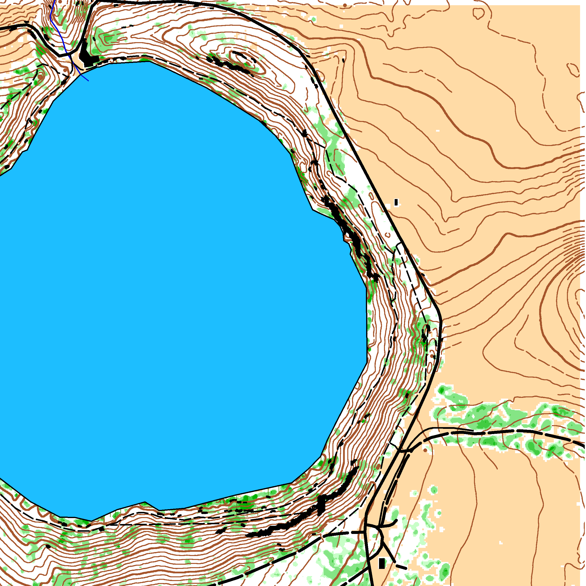
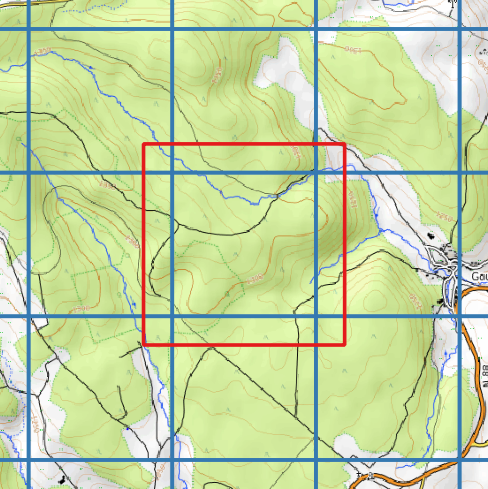

import GlossaryLink from "../../components/GlossaryLink.astro";

## What is Cassini

Cassini is a software that generates highly accurate [topographic maps](https://en.wikipedia.org/wiki/Topographic_map) from <GlossaryLink slug="lidar" /> data and <GlossaryLink slug="shapefile" /> vector data. The maps produced by Cassini follow the <GlossaryLink slug="isom" label="International Specification for Orienteering Maps (ISOM)" />, witch is the most detailed specification for [topographic maps](https://en.wikipedia.org/wiki/Topographic_map).

This project is heavily inspired by <GlossaryLink slug="karttapullautin" /> and [Terje Mathisen's pipeline](https://tmsw.no/mapping/basemap_generation.html). Unlike them, it uses <GlossaryLink slug="pdal" /> (The Point Data Abstraction Library) and <GlossaryLink slug="gdal" /> (The Geospatial Data Abstraction Library) to preprocess the <GlossaryLink slug="lidar" /> data.

:::caution
Cassini is very early stage and still an experimental project. Use it at your own risks, expect API changes and bugs! Please [fill an issue on Github](https://github.com/NicoRio42/cassini/issues/new) if you find any bug.
:::

:::note[Did you know?]
Cassini is (humbly) named after the [Cassini map](https://en.wikipedia.org/wiki/Cassini_map), which is the first topographic and geometric map made of the Kingdom of France as a whole, by the Cassini family in the 1700's.
:::

## Why does Cassini exist

Cassini is developped to be the main rendering engine for the [Mapant.fr](https://mapant.fr) project. The project goal is to generate the most precise topographic map of France out of freely available <GlossaryLink slug="lidar" /> data and <GlossaryLink slug="shapefile" /> data. It is inspired by its predecessors:

- [Mapant.fi](https://www.mapant.fi/) for Finland
- [Mapant.no](https://mapant.no/) for Norway
- [Gokartor](https://kartor.gokartor.se/) for Sweden
- [Mapant.es](https://mapant.es/) for Spain
- [Mapant.ch](https://www.mapant.ch/) for Switzerland
- [Mapant.orienteering.lu](https://mapant.orienteering.lu/) for Luxembourg

All of these projects somehow used [Jarkko Ryyppö](https://x.com/RouteGadget)'s [awsome Karttapullautin original Perl program](https://routegadget.net/karttapullautin/) to generate the map (at the exeption of [Mapant.ch](https://www.mapant.ch/) that used the <GlossaryLink slug="ocad" /> mapping software). Now that <GlossaryLink slug="karttapullautin" /> has been rewritten in <GlossaryLink slug="rust" /> by [Raphaël Stefanini](https://www.linkedin.com/in/rphlo/), the performances are better than ever.

However, there is some reasons that pushed me to develop my own rendering engine for [Mapant.fr](https://mapant.fr).

### The point cloud reading bottleneck

A <GlossaryLink slug="lidar" /> file is basically just a list of millions of 3 dimensions points (with some metadata). To process it, a program should at some point loop over all these points, witch is very time consuming. <GlossaryLink slug="karttapullautin" /> uses the popular [`las` Rust library](https://crates.io/crates/las) to do so. For some reason (that I ignore), this library performs worst than the <GlossaryLink slug="cpp" /> equivalent programs (<GlossaryLink slug="pdal" />, The Point Data Abstraction Library or <GlossaryLink slug="lastools" />).

### The edges artifacts problem

The surface area of France is 551,695 square kilometers. This means that there is 551,695 one kilometer large tiles to process to generate the [Mapant.fr](https://mapant.fr) map. This is way too much work for one computer, so it should be distributed on several machines.

To easily distribute the computing, a worker node should be able to render one tile after another independently. But this is easier said than done because of the edges artifacts problem.

On the right border of the <GlossaryLink slug="lidar" /> generated map above, you can see artifacts on <GlossaryLink slug="contours" /> and vegetation. There are artificially more [formlines](https://omapwiki.orienteering.sport/symbols/103-form-line/), and there is a thin vertical white band. This is because the <GlossaryLink slug="contours" /> and the vegetation generation algorithms need to know about the close neighborhood of a cell during computing, and this neighborhood is incomplete at the edges of a <GlossaryLink slug="lidar" /> file.

To remedy this problem, a classic approach is to add a buffer to every tiles:

- You download the 8 adjacent <GlossaryLink slug="lidar" /> tiles.
- You generate a new <GlossaryLink slug="lidar" /> tile with a 200 meters buffer all around it.
- You generate the map for this tile (for example with <GlossaryLink slug="karttapullautin" />).
- You crop the resulting image to the original tile extent

This way the artifacts are cropped away from the resulting image. This technique has the advantage of being simple. However, it is very inefficient. The problem is that:

- All the points of the 9 tiles (the targeted tile and the 8 adgacent ones) have to be read to create the buffered tile.
- Then, all the points from the buffered tile have to be read again during the map generation.

As mentioned in the previous paragraph, reading <GlossaryLink slug="lidar" /> points is very time consuming. It takes up a large part of the calculation time. With this approach, 10 times more points have to be read, compared to if you could just directly process the original tile without buffer.

### The Cassini approach

Cassini is designed to adress these two problems. To improve the point cloud reading speed, it simply uses the <GlossaryLink slug="pdal" /> library to read and preprocess the <GlossaryLink slug="lidar" /> data.

To solve the edges artifacts problem, it uses a much more efficient approach than the one described above. First, all <GlossaryLink slug="lidar" /> tiles are processed once with <GlossaryLink slug="pdal" />. During this step, the program produces temporary files that are not subject to the edges artifacts problem:

- A <GlossaryLink slug="dem" />, representing the terrain elevation
- A set of vegetation density <GlossaryLink slug="raster" label="rasters" /> (one for low vegetation, and one for high vegetation)

These <GlossaryLink slug="raster" label="rasters" /> are not subject to the edges artifacts problem because:

- The tile's extent area is clipped to one meter by one meter cells.
- A value is attributed to each of these cells depending only on the points that it contains.
- Thus the value does not depend on the neighborhood of the cell.

Then, a buffer is added to these raster, using the adgacent tiles <GlossaryLink slug="raster" label="rasters" /> just like in the approach described in the paragraph above. It is orders of magnitudes faster to add a buffer to a <GlossaryLink slug="raster" /> than to add a buffer to a <GlossaryLink slug="lidar" /> tile. Finally, the map is generated from these <GlossaryLink slug="raster" label="rasters" />. This approach guaranties that every <GlossaryLink slug="lidar" /> points are only read once.

### The tradeoffs

As mentioned, Cassini uses the <GlossaryLink slug="pdal" /> and the <GlossaryLink slug="gdal" /> libraries to process <GlossaryLink slug="lidar" /> and <GlossaryLink slug="raster" /> data. These libraries are very fast and efficient, but they are implemented in C++. As for now, their is no stable integration in the <GlossaryLink slug="rust" label="Rust programming language" /> for <GlossaryLink slug="pdal" /> and <GlossaryLink slug="gdal" />. Thus, they should be installed separately on the computer (using [Miniconda](https://docs.anaconda.com/miniconda/)). This is much more complexe and less beginner friendly than <GlossaryLink slug="karttapullautin" /> for example, that is a standalone program with no external runtime dependencies.

## Alternatives to Cassini

### Karttapullautin

<GlossaryLink slug="karttapullautin" /> is the project that inspired Cassini. It
is an all-in-one tool to generate highly accurate [topographic maps](https://en.wikipedia.org/wiki/Topographic_map)
from <GlossaryLink slug="lidar" /> data and <GlossaryLink slug="shapefile" /> data.
It originally was implemented in <GlossaryLink slug="perl" /> by [Jarkko Ryyppö](https://x.com/RouteGadget),
but has recently been rewritten in <GlossaryLink slug="rust" /> by [Raphaël Stefanini](https://www.linkedin.com/in/rphlo/).
It is pretty simple to start with, with a lot of configuration and customisation
possibilities. It is however a <GlossaryLink slug="cli" /> (like Cassini), so it
requires using a terminal.

### Terje Mathisen's pipeline

In 2013, Terje Mathisen wrote [an article](https://tmsw.no/mapping/basemap_generation.html) about a pipeline he developed to generate maps from <GlossaryLink slug="lidar" /> data. Being an orienteering mapper, his main goal was to output a base map to help him during his mapping surveys. His pipeline uses the <GlossaryLink slug="lastools" /> library to preprocess the <GlossaryLink slug="lidar" /> files, the same way that Cassini uses PDAL to do so. <GlossaryLink slug="lastools" /> being a licenced software, it constraints the usage of this pipeline. However, the accompanying article is very interesting by explaining the process step by step.

### OCAD

The <GlossaryLink slug="ocad" /> mapping software supports map generation from <GlossaryLink slug="lidar" /> data in its latest versions. Unlike the previously mentioned tools, <GlossaryLink slug="ocad" /> is a desktop application with a <GlossaryLink slug="gui" /> (GUI). It makes it accessible to users with less knowledges of Computer Science and programming. However, <GlossaryLink slug="ocad" /> is a licenced software.
